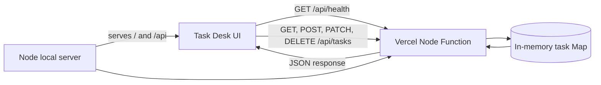

# Task Desk

[](https://devconnectplatform.com/u/azizulabedin?ref=badge)

Task Desk is a small task-management application with a focused browser UI and a JSON API. Add tasks, search them, filter by state, mark them complete, and remove them. It uses the same request handler locally and on Vercel.

## License

This project is licensed under the [MIT License](LICENSE). Copyright (c) 2026 Azizul Abedin.

## What is included

- A responsive task dashboard at `/`
- A Node.js API at `/api/*` on Vercel and both `/api/*` and direct paths locally
- Create, list, read, complete, and delete task operations
- A dependency-free local runtime
- An in-memory data store for a simple demo deployment

## Flow



## Prerequisites

- Node.js **20.11.1 or newer**
- npm **10.2.4 or newer** (bundled with Node.js 20.11.1)
- A Vercel account only when deploying

No database, package installation, or external service is needed for local development.

## Run locally

```bash
git clone <repository-url>
cd Documentation
node --version
npm start
```

Open [http://127.0.0.1:3000](http://127.0.0.1:3000) to use the UI. The local server also accepts:

```bash
curl -i http://127.0.0.1:3000/api/health
```

Expected response:

```http
HTTP/1.1 200 OK
content-type: application/json; charset=utf-8

{"status":"ok"}
```

Stop the server with `Ctrl+C`.

## Deploy to Vercel

The repository contains `vercel.json` and `api/index.js`, so no custom build step is required.

### Vercel dashboard

1. Push this repository to GitHub, GitLab, or Bitbucket.
2. In Vercel, select **Add New Project** and import the repository.
3. Keep **Framework Preset** as **Other**.
4. Leave the build command empty and deploy.
5. Open the generated URL. The UI is at `/` and the health check is at `/api/health`.

### Vercel CLI

```bash
npm install --global vercel
vercel login
vercel
vercel --prod
```

The Vercel Node function imports the same `handler` used by the local server. No environment variables are required for deployment.

## Configuration

The service reads these variables from the process environment. The `.env.example` file lists the local defaults, but this project does not load `.env` files automatically.

| Variable | Required | Default | Where the value comes from | Starts without it? |
| --- | --- | --- | --- | --- |
| `PORT` | No | `3000` | The local shell or hosting platform. Must be numeric. | Yes |
| `HOST` | No | `127.0.0.1` | The local shell or hosting platform. Use `0.0.0.0` for a container that accepts external traffic. | Yes |

`PORT` and `HOST` are used by the local Node server. Vercel supplies its own function listener, so neither variable is needed there.

PowerShell example:

```powershell
$env:PORT = "8080"
$env:HOST = "127.0.0.1"
npm start
```

## UI features

- Add a task with a required title.
- See total, open, and finished counts.
- Filter by all, open, or finished tasks.
- Search task titles.
- Toggle completion state.
- Delete a task.
- Refresh data from the API.
- See whether the API health check is online.

## Data model

Tasks are stored as objects in a process-local `Map`:

| Field | Type | Description |
| --- | --- | --- |
| `id` | string | Server-generated UUID. |
| `title` | string | Required, trimmed, and limited to 120 characters. |
| `completed` | boolean | Completion state; defaults to `false` when omitted. |
| `createdAt` | string | Server-generated ISO 8601 timestamp. |

## API reference

On Vercel, prefix every route below with `/api`. For local requests, `/api` is recommended because it matches production; the local server also accepts the same paths without the prefix. All response bodies are JSON except `204 No Content`. Request bodies must use `Content-Type: application/json`.

### `GET /health`

Returns process health. No input.

**`200 OK`**

```json
{"status":"ok"}
```

### `GET /tasks`

Returns all tasks currently held in memory. No input.

**`200 OK`**

```json
{"data":[{"id":"8f6...","title":"Read the README","completed":false,"createdAt":"2026-09-21T12:00:00.000Z"}]}
```

An empty collection returns `{"data":[]}`.

### `POST /tasks`

Creates a task.

**Request body**

```json
{"title":"Review the API","completed":false}
```

`title` is required. `completed` is optional and defaults to `false`.

**`201 Created`** returns the created task in `data`.

**`400 Bad Request`** is returned for invalid JSON, a missing or empty title, a title over 120 characters, or a non-boolean `completed` value.

```json
{"error":"title is required and must be a non-empty string"}
```

### `GET /tasks/:id`

Returns one task by UUID.

**`200 OK`** returns `{"data": <task>}`.

**`404 Not Found`** is returned when the ID does not exist:

```json
{"error":"Task not found"}
```

### `PATCH /tasks/:id`

Updates completion state. The title cannot be changed through this endpoint.

**Request body**

```json
{"completed":true}
```

**`200 OK`** returns the updated task in `data`.

**`400 Bad Request`** is returned when `completed` is not a boolean or the JSON is invalid.

**`404 Not Found`** is returned when the ID does not exist.

### `DELETE /tasks/:id`

Deletes one task by UUID.

**`204 No Content`** means the task was deleted successfully.

**`404 Not Found`** is returned when the ID does not exist.

### Any other route or method

**`404 Not Found`**

```json
{"error":"Route not found"}
```

## End-to-end API example

With the server running, create a task and list it:

```bash
curl -i -X POST http://127.0.0.1:3000/api/tasks \
  -H "Content-Type: application/json" \
  -d '{"title":"Review the API"}'

curl -i http://127.0.0.1:3000/api/tasks
```

PowerShell:

```powershell
Invoke-RestMethod -Method Post -Uri http://127.0.0.1:3000/api/tasks -ContentType "application/json" -Body '{"title":"Review the API"}'
Invoke-RestMethod -Uri http://127.0.0.1:3000/api/tasks
```

## Project structure

```text
api/index.js       Vercel function entry point
index.js            Vercel root adapter for the UI and API
public/index.html  Dashboard markup
public/app.js      UI state and API calls
public/styles.css  Responsive visual design
local.js           Local HTTP server and static asset server
api/handler.js     Shared serverless API handler
vercel.json        Vercel function configuration
```

## Limits and known issues

- Data is not persistent. All tasks disappear when the local process or a Vercel function instance is recycled.
- The in-memory store is not shared between Vercel instances, so this is a demo and not a reliable multi-user production task service.
- There is no authentication, authorization, pagination, filtering on the API, rate limiting, metrics, tracing, or audit log.
- There is no automated test suite yet; the documented API calls are the current smoke tests.
- `PORT` is parsed as a number, but invalid values fail when Node tries to bind.
- The UI does not provide optimistic updates or offline support.

## Decisions to revisit at 10x traffic

1. Replace the process-local `Map` with PostgreSQL or another durable store, with migrations and indexes.
2. Add a connection pool, API pagination, server-side filtering, and response limits.
3. Run stateless instances behind a load balancer and add readiness and liveness checks.
4. Add authentication, authorization, rate limiting, structured logs, metrics, traces, and centralized error monitoring.
5. Add automated unit and integration tests, then measure latency and memory use under representative load.
